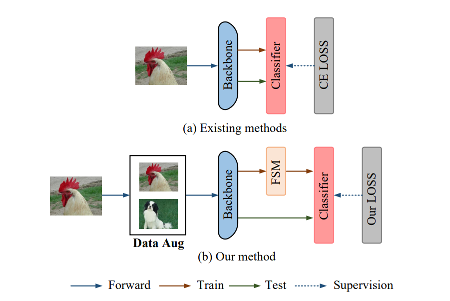

# <div align="center">Feature Scaling Guided Leaning for Long-tailed Visual Recognition</div>

<font size = "3">**Tao Wang\*, Jun You\*, Yuan Zheng**</font>


## Abstract
<div align="center">
  
</div>

In real-world scenarios, the data generally follows a long-tailed distribution. Although a large amount of research on long-tailed visual recognition have emerged, they still suffer from an insufficient discriminative learning especially for tail categories. To address this issue, we propose a novel Feature Scaling Guided Learning (FSGL) for long-tailed visual recognition. Considering that the denser feature points correspond to majority classes while the sparser ones correspond to minority classes, we argue that increasing the density in feature space helps to improve the discriminative learning especially for tail classes. In view of this, we provide a Feature Scaling Module (FSM) to adaptively scale the features according to class frequency. Meanwhile, we introduce the data augmentation techniques and a new classification loss that takes into account both the representation learning of tail classes and the class consistency under different data augmentations. Experiments on CIFAR10-LT, CIFAR100-LT and ImageNet-LT datasets vefify the superiority of our FSGL over existing SOTA methods.


## Getting started

* ### Requirements
	<ul>
	<li>pytorch 1.9.1</li>
	<li>torchvision 0.10.1</li>
	<li>wandb 0.12.2</li>
	<li>timm 0.5.5</li>
	<li>prettytable 2.2.0</li>
	<li> scikit-learn </li>
	<li> matplotlib </li>
	<li> tensorboardX </li>
	</ul>


* ### Datasets
   The datasets used in the repository can be downloaded by following instructions from the following links:
	   <ul>
       <li>[ImageNet-LT](https://github.com/zhmiao/OpenLongTailRecognition-OLTR) </li>
	   </ul>
	The CIFAR datasets are automatically downloaded to the ```data/``` folder if it is not available.

## Training

Sample command to train CIFAR-10 LT dataset.

`python main.py --dataset cifar10 -a resnet34 --num_classes 10 --imbanlance_rate 0.02 --beta 0.5 --lr 0.01 --epochs 200 -b 64 --momentum 0.9 --weight_decay 5e-3 --resample_weighting 0.0 --label_weighting 1.2  --contrast_weight 4 --rho 0.05 --fcc 0.5`

Sample command to train CIFAR-100 LT dataset.

`python main.py --dataset cifar100 -a resnet34 --num_classes 100 --imbanlance_rate 0.02 --beta 0.5 --lr 0.01 --epochs 200 -b 64 --momentum 0.9 --weight_decay 5e-3 --resample_weighting 0.0 --label_weighting 1.2  --contrast_weight 4 --rho 0.05 --fcc 1`

Sample command to train ImageNet-LT dataset. 

`python main.py --dataset ImageNet-LT -a resnext50_32x4d --num_classes 1000 --beta 0.5 --lr 0.1 --epochs 135 -b 120 --momentum 0.9 --weight_decay 2e-4 --resample_weighting 0.2 --label_weighting 1.0 --contrast_weight 4 --fcc 0.1`

All the commands to reproduce the experiments are available in `run.sh` 

### Results
We show results on CIFAR-10 LT, CIFAR-100 LT, ImageNet-LT dataset. Complete results is available in the paper.
<div align="center">
<table>
    <thead>
        <tr>
            <th>Dataset</th>
            <th>Method</th>
            <th>Accuracy</th>
        </tr>
    </thead>
    <tbody>
        <tr>
            <td rowspan=2> CIFAR-10 LT (IF=50)</td>
            <td>FSGL</td>
            <td>92.2</td>
        </tr>
        <tr>
            <td rowspan=2> CIFAR-10 LT (IF=100)</td>
            <td>FSGL</td>
            <td>89.3</td>
        </tr>
		<tr>
            <td rowspan=2> CIFAR-100 LT (IF=50)</td>
            <td>FSGL</td>
            <td>63.4</td>
        </tr>
        <tr>
            <td rowspan=2> CIFAR-100 LT (IF=100)</td>
            <td>FSGL</td>
            <td>59.2</td>
        </tr>
        <tr>
            <td rowspan=2> ImageNet-LT</td>
            <td>FSGL</td>
            <td>57.2</td>
        </tr>
        </tr>
    </tbody>
</table>
</div>


## Overview of the arguments 

Generally, all python scripts in the project take the following flags
- `-a`: Architecture of the backbone. `(resnet32|resnet50)`
- `--dataset`: Dataset `(cifar10|cifar100)` 
- `--imb_factor`: Imbalance Factor (Ratio of samples in the minority class to majority class). Default: 0.01    
- `--epochs`: Number of Epochs to be trained for. Default 200.
- `--rho`: $\rho$ value in SAM (Applicable to SAM runs).
- `--fcc`: Scaling factors value in FSM.


